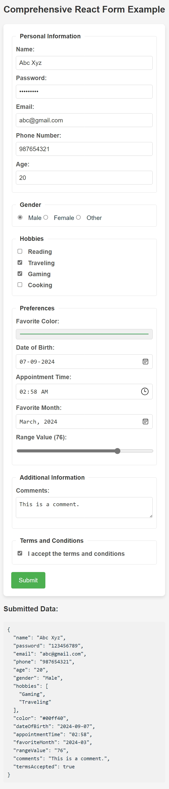

# Comprehensive React Form Example

This project demonstrates a React-based form with a wide range of input types. It captures user data, manages state efficiently, and displays the submitted data in JSON format. This example is ideal for learning how to handle complex forms in React.

## Table of Contents

-   [Features](#features)
-   [Getting Started](#getting-started)
-   [Installation](#installation)
-   [Usage](#usage)
-   [Components](#components)
-   [Styling](#styling)
-   [Contributing](#contributing)
-   [License](#license)

## Features

-   **State Management:** Centralized form state using React's `useState`.
-   **Input Types:** Supports text, password, email, phone, number, radio buttons, checkboxes, color pickers, date/time/month pickers, range sliders, and text areas.
-   **Form Validation:** Required fields are enforced.
-   **Real-Time Feedback:** Displays submitted data in JSON format.

## Getting Started

### Prerequisites

Make sure you have the following installed:

-   Node.js (v12 or higher)
-   npm (v6 or higher) or yarn

### Installation

1. Clone the repository:

    ```bash
    git clone https://github.com/yourusername/comprehensive-react-form.git
    cd comprehensive-react-form
    ```

2. Install dependencies:

    ```bash
    npm install
    # or
    yarn install
    ```

### Usage

To start the development server:

```bash
npm start
# or
yarn start
```

Open [http://localhost:3000](http://localhost:3000) in your browser to view the form.

### Components

-   **Form Inputs:** Includes various input fields such as text, password, email, phone, etc.
-   **Radio Buttons and Checkboxes:** Handles multiple selections.
-   **Color and Date Pickers:** Allows users to select colors and dates.
-   **Range Slider:** Adjust a value within a specified range.
-   **Textarea:** Collects multi-line text input.
-   **Terms and Conditions Checkbox:** Ensures user consent before submission.
-   **Form Submission:** Logs the form data in JSON format.

### Example Output

After filling out the form, the submitted data will be displayed in JSON format below the form.


